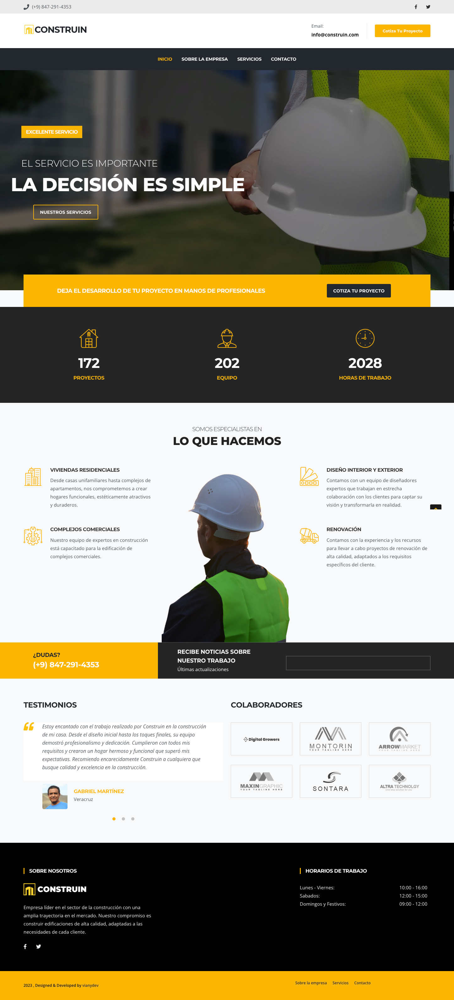
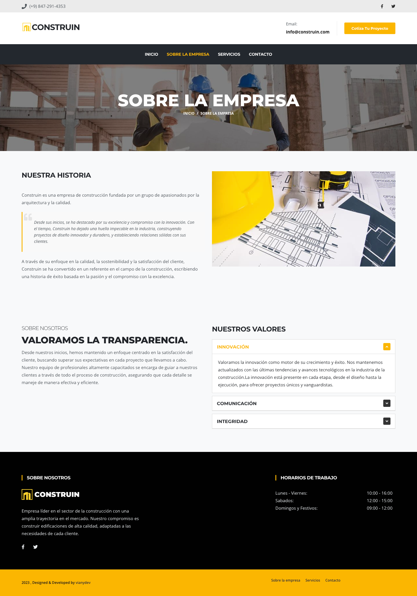
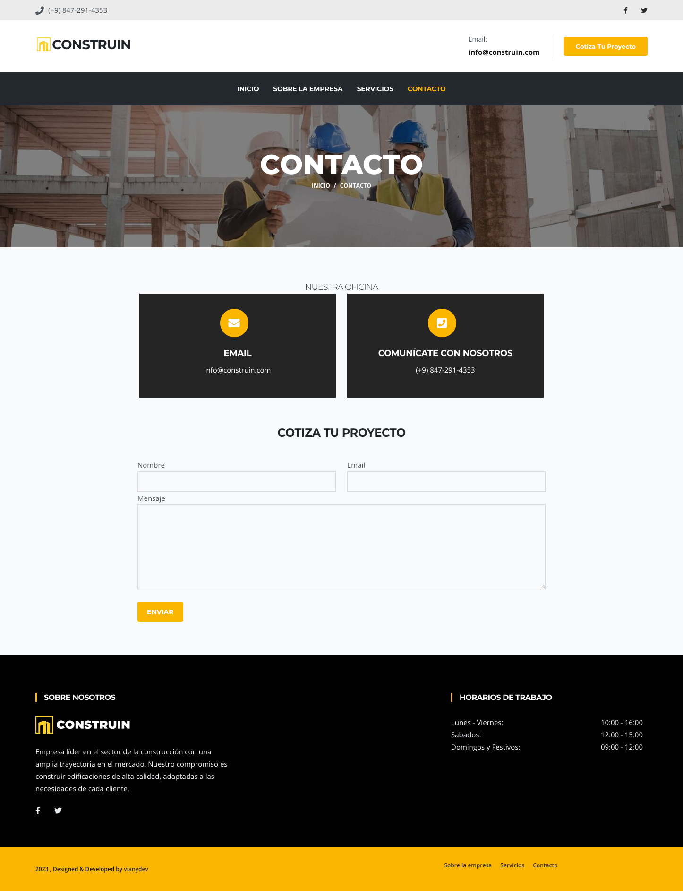

# Construin

|  |  |
|:---:|:---:|
| **Homepage**  | **Services**  |
|  |  |
| **About** | **Contact** |

## Table of contents

- [Overview](#overview)
  - [Links](#links)
- [My process](#my-process)
  - [Built with](#built-with)
  - [Resources](#useful-resources)
- [Author](#author)

## Overview

### Links

- Code: [Solution URL](https://github.com/vianydev/construin)
- Live Site URL: [Live site URL](https://vianydev.github.io/construin/)

## My process

### Built with

- Semantic HTML5 markup
- CSS custom properties
- Flexbox

### Resources

* **Bootstrap v5.3.0-alpha3**: <https://getbootstrap.com/docs/5.3/getting-started/download/>
* **Jquery v3.5.1**: <https://jquery.com/download/>
* **Google Fonts**: <http://fonts.google.com/>
* **Font Awesome Free**: <https://fontawesome.com/>
* **Animate CSS**: <https://animate.style/>
* **Colorbox**: <https://www.jacklmoore.com/colorbox/>
* **Slick**: <https://kenwheeler.github.io/slick/>

## Author

Designed & Developed by [vianydev](https://vianydev.github.io)
- Twitter - [@vianydev](https://www.twitter.com/vianydev)
- Linkedin - [@vianydev](https://www.linkedin.com/in/vianydev/)
- Github - [@vianydev](https://github.com/vianydev)

